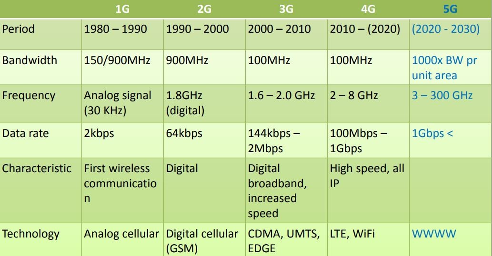

# EC610 | Mobile Communication

[👈 Back](./../)

<a class="white" href="https://youtube.com/playlist?list=PLFkKAMLbnTTsK4qAu_I-sZYDgwI0L__oK">
YouTube Playlist
</a>

## [1. Unit 1 - Part 1](./chap-1%20mc%20cont.pdf)
  - Done in offline class

## [2. Unit 1 - Part 2](./mobile%20communication-chap1.pdf)
## [3. Unit 1 - Notes](./EC610%20-%20Unit%201%20Notes.pdf)
## [4. Unit 2 - Textbook (OCR Version)](./EC610%20-%20Unit%201%20Notes.pdf)
- Searchable PDF

# Important

