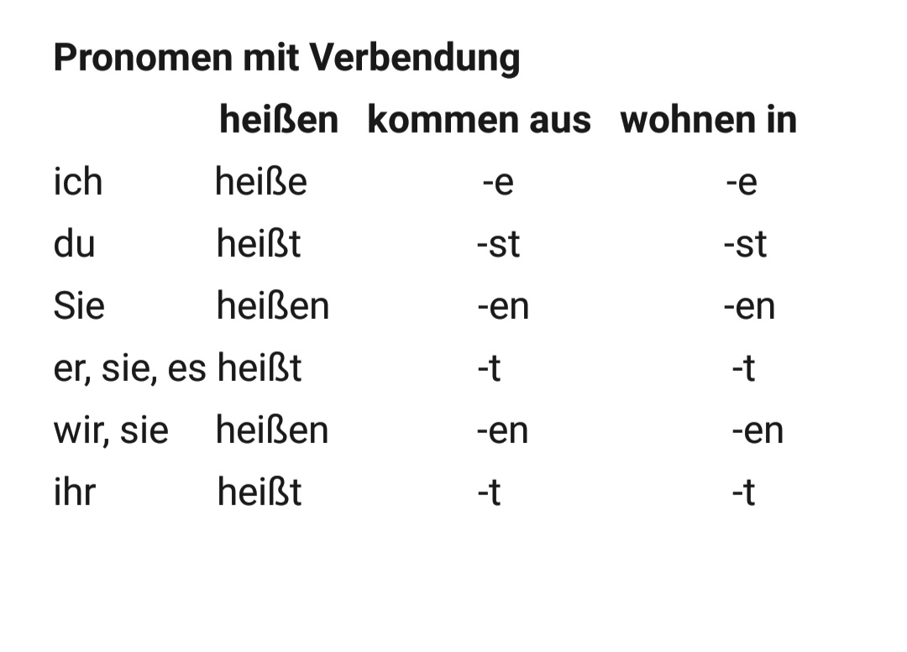

# HU68S | German

[👈 Back](./../)

<a class="white" href="https://youtube.com/playlist?list=PLFkKAMLbnTTsgwnkT0x0ZTg7VIklw3Zy-">
YouTube Playlist
</a>

<!-- ## [1. Text Book - Forouzan](./Computer%20Networks%20-%20Text%20Book%20-%20Behrouz%20A%20Forouzan.pdf)
## [2. PPT Online Class](./Data%20Communication%20and%20Networking%20-%20Forouzan.pdf) -->

## Class 1 Portions

## Class 2 Portions

- die Familie
- der Vater
- die Mutter
- der Bruder
- die Schwester
- der Großvater
- die Großmutter

---

- die Familie
- (mein) der Vater
- (meine) die Mutter
- der Bruder
- die Schwester
- der Großvater
- die Großmutter

## Class 3 Portions

- die Bekante (the acquaintance)
- der Freund
- die Freundin
- der Nachbar
- die Nachbarin
- der Lehrer
- die Lehrerin
- der Student
- die Studentin

## Class 4 Portions

- das Frühstück
- das Mittagessen
- das Abendessen
---
- das Brot
- das Brötchen
- die Marmelade
- die Butter
- das Fleisch
- der Reis
- das Curry
- das Gemüse
---
- das Getränk
- der Tee
- der Kaffee
- die Milch
- der Orangensaft
- das Wasser

## Class 5 Portions
### 2nd chapter after 1st Internals

- zum Picknick.
- für den Urlaub.
- für den Sommer.

- die Natur
- die Berge.
- die Hügel.
- der Strand.
- das Meer.
- die Altstadt.
- der Wald.
- die Sehenswürdigkeiten.
- die Touristenattraktionen.

- gehen 
- ich gehe 
- du gehst 
- Sie gehen 
- er, sie, es geht 
- wir, sie gehen 
- ihr geht 

- Gehen Sie bitte rechts. 
- Gehen Sie bitte links. 
- Gehen Sie bitte geradeaus.

- Wie kann ich zum Cafe bitte?
- Wie komme ich zum Cafe bitte?

---

## 3rd Chapter after 1st Internals

- **das Apartment**
- das Haus
- das Familienhaus
- das Studentenwohnheim
- das Bauernhaus
- das Hochhaus

- das Wohnzimmer
- das Badezimmer
- die Küche
- der Balkon
- der Flur

---

## 4th Chapter after 1st Internals - 17/06/2021

- die Hobbys
- Roman lesen
- Fußball spielen
- Kochen
- Radfahren
- Wandern
- Singen
- Tanzen

- Was ist dein Hobby?
- Was sind deine Hobbys?

---

## 5th Chapter after 1st Internals - 17/06/2021

- die Feste und die Feiere
- das Fest
- die Feier
- der Geburtstag
- der Gebrtstag
- die Einweihungsparty
- die Abschlussfeier
- Weihnachten
- Ostern

- die Jahrezeiten
- im Sommer
- im Herbst
- im Winter
- im Frühling
- im Monsun

